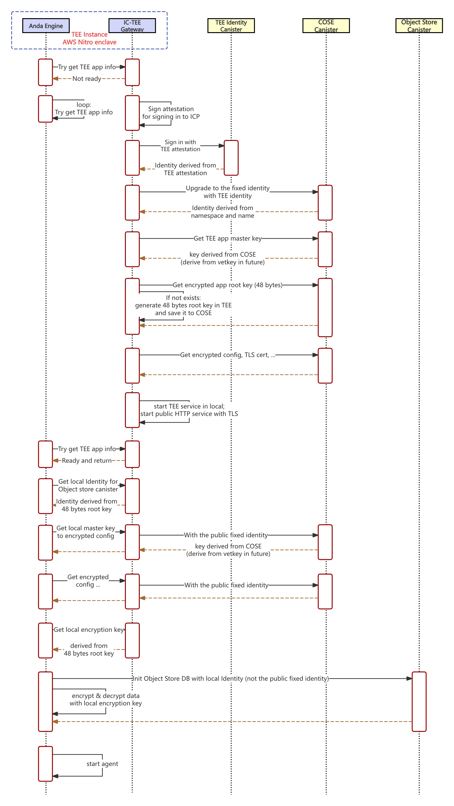

# Anda 架构设计

## 简介

`Anda` 是一个创新的智能体开发框架，旨在构建一个高度可组合、自主性强且具有永久记忆的 AI 智能体网络。通过连接各行各业的智能体，Anda 致力于打造一个超级 AGI 系统，推动人工智能向更高层次发展。

本文介绍了 Anda 框架的系统架构和核心组件。

**资源**:
- [GitHub: 项目源代码](https://github.com/ldclabs/anda)
- [扩展（Extensions）: 核心 agents & tools 的实现](https://github.com/ldclabs/anda/tree/main/anda_engine/src/extension)
- [Anda Bot: 一个 AI Agent 智能体的完整实现](https://github.com/ldclabs/anda/tree/main/agents/anda_bot)
- [Anda bot（X 平台应用）](https://x.com/AndaICP)

## 系统架构


要运行完整的 Anda AI Agent 程序（下面简称为 Anda），需要3种外部资源，分别是 **LLM 服务**、**TEE 计算**和 **ICP 区块链**；以及两个内部服务，即 **Anda Engine** 和 **IC-TEE Gateway**。

### LLM 服务

LLM 服务为 Anda 提供智能算力，就像一种 GPU 云服务，它是可以替换的。目前 Anda 框架内支持了 DeepSeek、Cohere 和 OpenAI，未来会支持更多的 LLM 服务，包括用 TEE GPU 运行开源的 LLMs。

目前来说，DeepSeek 和 Cohere 是性价比最高的，以极低的价格提供了令人惊叹的智能算力。为了极致的安全和隐私，使用 TEE GPU 运行 DeepSeek 将是最佳选择。

### TEE 计算

TEE 计算为 Anda 提供硬件级的安全隔离计算环境和身份证明。目前 Anda 框架通过 IC-TEE 支持了 AWS Nitro enclave，未来会支持 Intel SGX，NVIDIA 的 TEE GPU 等。只有运行在 TEE 中，我们才可相信并验证 Anda 还是那个 Anda，它没有被篡改，它的计算状态（如密钥等）也处于安全环境不会被窃取。

### ICP 区块链

ICP 区块链为 Anda 提供了必要的去中心化的身份证明、根密钥和数据存储，以及代币经济体系和 DAO 治理机制。

因为 TEE 是无状态的计算环境，并且 Anda 的每次升级都会导致 TEE Attestation 指纹变化。Anda 的运行状态需要存储在 ICP 区块链上，如果程序崩溃、TEE 重启或者切换不同的 TEE，Anda 才能从中恢复状态。Anda 也需要 ICP 为其提供一种永久固定的链上身份证明，这样它才能与外界其它系统进行可信交互。

### Anda Engine

Anda Engine 是 Anda 的核心调度引擎。一个 Anda AI Agent 可以包含多个 agents 和 tools，它们被注册到 Engine 中，可以被 Engine 自动调度执行。我们将在下一部分详细介绍 Engine 的架构和工作原理。

### IC-TEE Gateway

[IC-TEE](https://github.com/ldclabs/ic-tee) 为 Anda 提供了运行在 TEE 的内部环境，它由多个组件组成。IC-TEE Gateway 是 Anda 与 TEE 即外界（包括 ICP 区块链）之间的桥梁。

TEE 启动后，IC-TEE Gateway 会做如下工作：
1. 打通 TEE 本地与宿主机的通信通道；
2. 利用 TEE Attestation 从 ICP Identity canister 合约获取 Anda 的临时身份证明
3. 利用临时身份证明换取永久身份证明；
4. 用永久身份从 ICP COSE canister 合约读取加密配置文件、TLS 证书以及 Anda 的根密钥。加密配置文件和 TLS 证书需要开发者提前上传到 COSE canister，而根密钥则是首次启动时在 TEE 中生成并加密存储到 COSE canister 中，后续每次启动都会从 COSE canister 中读取并解密，永久固定，不再变化。
5. IC-TEE Gateway 会用 TLS 证书启动一个 HTTPS 服务，让外界可以安全地与 Anda 通信。
6. 一切都准备好了，Anda Engine 开始与 IC-TEE Gateway 通信、启动并对外提供服务。
7. Anda Engine 启动后，IC-TEE Gateway 为其提供的核心服务包括：
   - 从根密钥派生一系列密钥相关服务；
   - 代理 ICP canisters 请求，所以 Anda 调用 canisters 都会用同一个永久身份，当然应用层也可以从密钥服务派生确定性的子身份与 ICP canisters 交互；
   - 代理外界到 Anda Engine 的 HTTPs 请求。



## Anda 引擎架构

### 核心库

| 库名称        | 描述                   | 文档                                               |
| ------------- | ---------------------- | -------------------------------------------------- |
| `anda_core`   | 定义特性、类型和接口   | [docs.rs/anda_core](https://docs.rs/anda_core)     |
| `anda_engine` | 实现运行时、集成和工具 | [docs.rs/anda_engine](https://docs.rs/anda_engine) |

### 核心组件

#### [代理（Agents）](https://docs.rs/anda_core/latest/anda_core/agent/index.html)

- 使用 `Agent` 特性定义 AI 代理，该特性指定了执行逻辑、依赖关系和元数据等能力。
- 使用 `AgentSet` 管理多个代理，并通过 `AgentDyn` 实现动态分发，以实现运行时的灵活性。
- 示例用例：数据提取、文档分割、角色扮演 AI。

```rust
// 简化的 Agent 特性定义
pub trait Agent<C: AgentContext> {
    fn name(&self) -> String;

    fn description(&self) -> String;

    fn definition(&self) -> FunctionDefinition;

    fn supported_resource_tags(&self) -> Vec<String>;

    fn tool_dependencies(&self) -> Vec<String>;

    async fn init(&self, ctx: C);

    async fn run(
        &self,
        ctx: C,
        prompt: String,
        resources: Option<Vec<Resource>>,
    ) -> Result<AgentOutput, BoxError>;
}
```

#### [工具（Tools）](https://docs.rs/anda_core/latest/anda_core/tool/index.html)

- 通过 `Tool` 特性实现可重用的工具（例如 API、区块链交互）。工具强制执行类型安全的输入/输出，并自动生成 JSON 函数定义以便与 LLM 集成。
- 使用 `ToolSet` 管理工具，并通过 `ToolDyn` 动态调用它们。

```rust
// 简化的 Tool 特性定义
pub trait Tool<BaseContext> {
    type Args: DeserializeOwned;
    type Output: Serialize;

    fn name(&self) -> String;

    fn description(&self) -> String;

    fn definition(&self) -> FunctionDefinition;

    fn supported_resource_tags(&self) -> Vec<String>;

    async fn init(&self, ctx: C);

    async fn call(
        &self,
        ctx: C,
        args: Self::Args,
        resources: Option<Vec<Resource>>,
    ) -> Result<ToolOutput<Self::Output>, BoxError>;
}
```

#### [上下文（Context）](https://docs.rs/anda_core/latest/anda_core/context/index.html)

- `BaseContext` 为代理和工具提供了基础操作和执行环境，结合了以下功能：
  - **StateFeatures**：用户、调用者、时间和异步任务取消令牌
  - **KeysFeatures**：Agents/Tools 隔离的加密密钥操作
  - **StoreFeatures**：Agents/Tools 隔离的持久化存储
  - **CacheFeatures**：具有 TTL/TTI 过期机制和 Agents/Tools 隔离的内存缓存存储
  - **CanisterFeatures**：ICP 区块链交互
  - **HttpFeatures**：HTTPs 请求能力
- `AgentContext` 为代理提供了执行环境。它结合了所有 `BaseContext` 功能和 AI 特定功能：
  - **CompletionFeatures**：为代理提供 LLM 完成能力。
  - **EmbeddingFeatures**：为代理提供文本嵌入能力。
  - **运行时功能**：调用工具（`tool_call`、`remote_tool_call`、`tool_definitions`）和运行代理（`agent_run`、`remote_agent_run`、`agent_definitions`）。注意，Agent 可以通过 AgentContext 调用本地或者远程的其它 Agents 和 Tools，可以是按照 Agent 编程逻辑明确调用，也可以根据大模型的建议自动调用！
- [`BaseCtx`](https://docs.rs/anda_engine/latest/anda_engine/context/struct.BaseCtx.html) 是 `BaseContext` 的实现。
- [`AgentCtx`](https://docs.rs/anda_engine/latest/anda_engine/context/struct.AgentCtx.html) 是 `AgentContext` 的实现。

#### [模型（Models）](https://docs.rs/anda_core/latest/anda_core/model/index.html)

定义 AI 交互的数据结构：
  - `CompletionRequest`：包含聊天历史、文档和工具的 LLM 提示。
  - `AgentOutput`：代理执行的结果。
  - `Embedding`：文本到向量的表示。

#### [引擎（Engine）](https://docs.rs/anda_engine/latest/anda_engine/engine/index.html)

- `Engine` 负责协调代理和工具的执行，提供构建器模式以进行配置。
- 使用 `EngineBuilder` 注册代理/工具并设置执行参数。

```rust
let engine = Engine::builder()
   .with_name(my_agent_name)
   .with_tee_client(my_tee_client)
   .with_model(my_llm_model)
   .register_tool(my_tool)
   .register_agent(my_agent)
   .build("default_agent")?;

let output = engine.agent_run(caller, AgentInput{ prompt: "Hello".to_string(), ..Default::default() }).await?;
```

### 关键特性

- **模块化**：分离代理、工具和上下文功能，实现清晰的架构。
- **类型安全**：强类型接口减少了运行时错误。
- **异步执行**：非阻塞 I/O 以提高资源利用率。
- **上下文层次结构**：支持取消的隔离执行上下文。
- **安全操作**：通过 TEE（可信执行环境）内置加密、验证调用者身份和安全存储。
- **存储**：内存缓存、对象存储 + 向量搜索能力。
- **可扩展性**：添加自定义代理/工具或通过新特性扩展 `BaseContext` 和 `AgentContext`。

## 结论

以上概述了 Anda 智能体的完整组成。虽然它可能看起来复杂，但 Anda 框架封装了这种复杂性，使开发人员能够专注于业务逻辑，并快速在 Anda 上构建安全、高效和可扩展的智能体。

### 未来展望

基于代币经济系统和 DAO 治理机制，Anda 代理可以在为外部世界提供服务的同时产生收入，形成一个正反馈循环，推动代理生态系统的增长。
